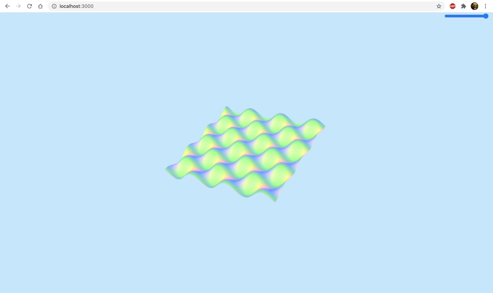
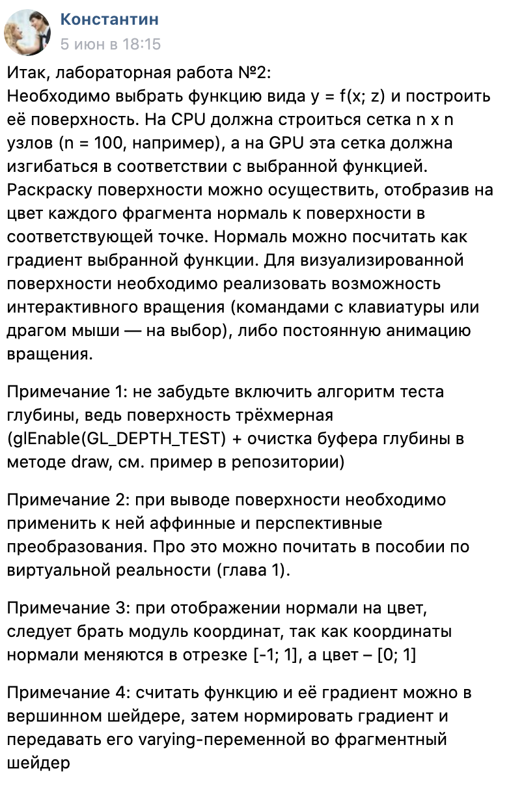

# Lab-2-webgl
вторая лабораторная работа по webgl

для запуска нужно запустить файл app.js через node (node app.js)

Результат:

ТЗ:

Для поворота используются клавиши W, A, S, D, Z, X
Для перемещения используются клавиши стрелок
